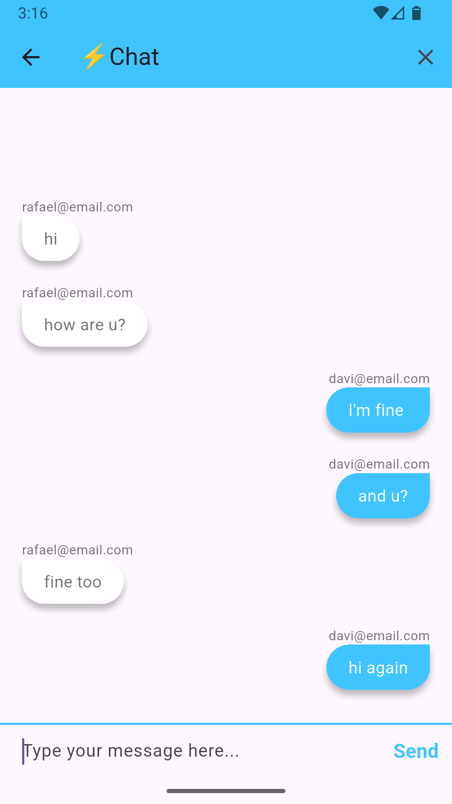
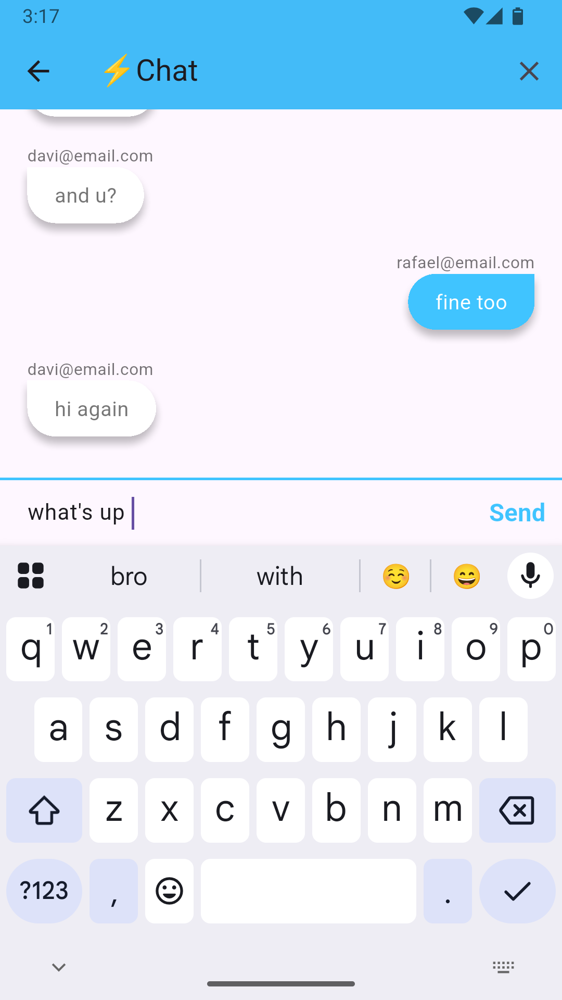

# 💬 Flash Chat App 

# 📱 Demo
<p align="center">
	
    
    
</p>

A **real-time chat application**, developed in **Flutter**, with a **user authentication** system and instant messaging.

This project was created focusing on learning **authentication, screen navigation, component reuse, and real-time communication**, following best practices for code organization.

---

## 📱 Features

- 🔐 User registration
- 🔑 Login with email and password
- 💬 Sending and receiving messages in real time
- 👥 Chat between multiple users
- 🔄 Automatic message updates
- 🎨 Simple and intuitive interface

---

## 🛠️ Technologies Used

- **Flutter**
- **Dart**
- **Firebase Authentication**
- **Firebase Cloud Firestore**
- **StreamBuilder**
- **Reusable Widgets**

---

## 📂 Project Structure

 ```
lib/
├── main.dart
├── screens/
│ ├── welcome_screen.dart
│ ├── login_screen.dart
│ ├── registration_screen.dart
│ └── chat_screen.dart
├── components/
│ └── rounded_button.dart
├── utils/
│ └── constants.dart
 
 ```
